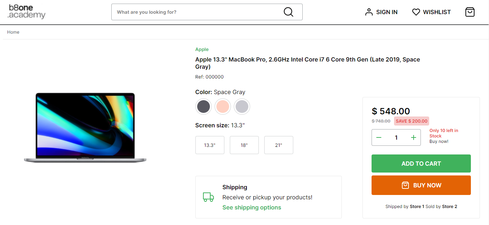
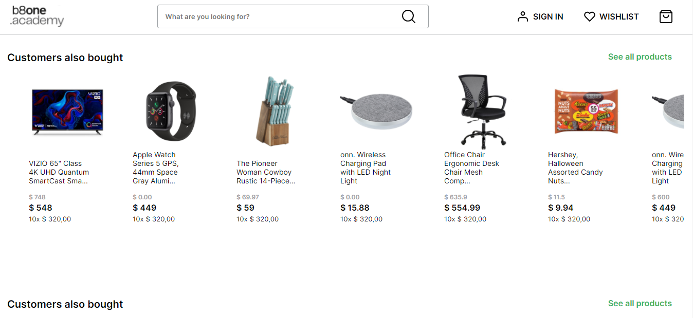

 

## 💻 Projeto

Marketplace desenvolvido para o teste seletivo da b8one com o objetivo de avaliar o desenvolvimento frontend.

**Foram feitas algumas interações:**

- Aumentar e diminuir a quantidade do produto em destaque
- Adicionar item ao carrinho
- Verificação de estoque antes de adicionar
- Selecionar produto a partir da listagem

O projeto está todo responsivo, adaptado para desktop, tablet e celular.

 

## ✨ Tecnologias

Esse projeto foi desenvolvido com as seguintes tecnologias:

- HTML
- CSS
- JavaScript

 

## 🚀 Como executar

- Abra o arquivo `src/pages/home/index.html` em seu navegador.
